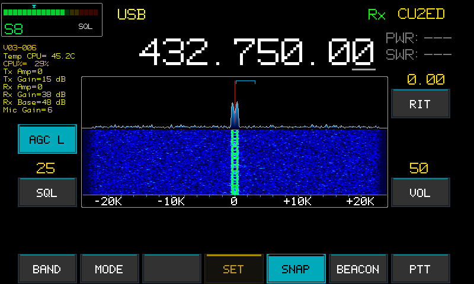

# Langstone-JR

**Langstone SDR Transceiver — adapted for Raspberry Pi 5 + HackRF One**

[](https://www.gnu.org/licenses/gpl-3.0)
[](https://www.raspberrypi.com/)
[](https://greatscottgadgets.com/hackrf/)

---

## About

Langstone-JR is a fork and adaptation of the original **Langstone V3 SDR Transceiver** project by **Colin Durbridge G4EML**, ported and extended to run on the **Raspberry Pi 5** with the **HackRF One** SDR module.



This is an experimental project to produce a simple VHF, UHF and Microwave SDR Transceiver operating on SSB, CW and FM modes, using a touchscreen interface and mouse-wheel tuning.

It was inspired by the very successful Portsdown Amateur Television system created by the British Amateur Television Club.

More information about the original Langstone project can be found on the UK Microwave group wiki:
**<https://wiki.microwavers.org.uk/Langstone_Project>**

---

## Origin and Authorship

> This repository is a **personal fork** of [Langstone V3](https://github.com/G4EML/Langstone) by Colin Durbridge G4EML, originally licensed under GPL-3.0.

The RPi5 and HackRF One support was already established in the upstream project by G4EML. This fork takes that as a starting point and applies a set of personal ideas, UI improvements and hardware additions by **Jacinto Rebelo — CU2ED** (Azores, Portugal):

- **Redesigned screen layout** — reorganised UI panels and controls to better suit the 7" touchscreen form factor
- **Enhanced on-screen information** — additional data displayed in real time (frequency, mode, signal info)
- **Waterfall and spectrum improvements** — modified colour palette, scaling and layout for better readability
- **I²C power and SWR meter** — hardware integration of an external I²C meter for real-time TX monitoring
- **AGC optimisation** — tuned automatic gain control parameters for improved receive dynamic range and audio consistency
- **TX audio equalizer** — added TX equalizer stage in the GNURadio flowgraph for better microphone frequency response shaping
- **CPU optimisation for RPi5** — processing pipeline tuned to reduce CPU load and improve responsiveness on the RPi5
- **Snap package support** — added snap-based distribution for easier deployment
- **Auto-update mechanism** — automatic update routine built into the run scripts

All original authorship and copyright of the upstream code belongs to Colin Durbridge G4EML and contributors.
Modifications in this repository are Copyright © 2024–2025 Jacinto Rebelo — CU2ED.

---

## Hardware Requirements

- **Raspberry Pi 5** (RPi4 reportedly works with Pluto only, not HackRF)
- Official Raspberry Pi **7" 800×480 Version 1** touchscreen
- RPi5-to-touchscreen flat cable *(may need separate purchase)*
- **HackRF One** SDR module
- USB audio module (CM108-based recommended — Volume Down button can act as PTT)
- USB scroll mouse
- PTT via GPIO 17 (pin 11) — needs pull-up to 3.3V; ground to TX
- CW key via GPIO 18 (pin 12) — needs pull-up to 3.3V; ground to key
- TX output on GPIO 21 (pin 40) — goes high when transmitting (100ms sequencing delay)
- 8× Band select outputs on GPIO 1, 19, 4, 25, 22, 24, 10, 9

---

## Installation (HackRF One)

SSH into your Raspberry Pi (user: `pi`, password: `raspberry`) and run:

```bash
wget https://raw.githubusercontent.com/jacintomfr/Langstone-JR/master/installHack.sh
chmod +x installHack.sh
./installHack.sh
```

The build process is fully automated and takes several minutes. The Pi will reboot when complete and start Langstone automatically.

> **Note:** Use **Raspberry Pi OS Lite (64-bit)**. The full desktop version is not supported.

---

## Updating

If you already have Langstone-JR installed:

```bash
cd Langstone
./stop
./update
sudo reboot
```

---

## Software Architecture

The software consists of two parts:

1. **SDR engine** — a Python/GNURadio flowgraph (`Lang_TRX_Hack.py`) generated from `Lang_TRX_Hack.grc` and manually extended with `ControlTRX_Hack.py`
2. **GUI frontend** — written in C (`LangstoneGUI_Hack.c`), communicating with GNURadio via a Linux pipe

---

## License

This project is licensed under the **GNU General Public License v3.0**.
See the [LICENSE](LICENSE) file for full terms.

This license applies to all modifications made in this repository. The original upstream code retains its original copyright by Colin Durbridge G4EML and is also GPL-3.0 licensed.

---

## Disclaimer

This software is provided **"as is"**, without warranty of any kind.
Amateur radio transmissions must comply with your national regulations and band plan.
Use at your own risk.

---

## Acknowledgements

- **Colin Durbridge G4EML** — original Langstone V3 project
- **British Amateur Television Club (BATC)** — Portsdown ATV system inspiration
- **UK Microwave Group** — documentation and community support
- GNURadio, HackRF, and the broader SDR open source community

---

*73 de CU2ED — Azores, Portugal*
